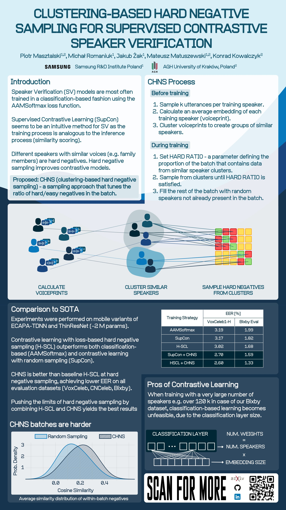

# CHNS: Clustering-based hard negative sampling for supervised contrastive speaker verification

This repository contains the training source code for experiments from the Interspeech 2025 publication "Clustering-based hard negative sampling for supervised contrastive speaker verification"

<p align="center">
  <a href="https://arxiv.org/abs/2507.17540" style="font-size:20px;">Full Paper</a>
</p>

<p align="center">
  
</p>

## Updates

**TODO**: Add dataset preparation guide to readme.

**12.08.2025**: Added training configs and poster.  
**04.07.2025**: Release a WIP version of the repo. No training configs included.

## Setup

In the root directory of this repository create a virtual environment with python 3.10.

```bash
virtualenv venv -p python3.10
```

and activate it

```bash
source venv/bin/activate
```

Install required packages. Feel free to modify the `requirements.txt` so that it matches your cuda version.

```bash
pip install -r requirements.txt
```

After trat run:

```bash
pip install -e .
```

## Train

This project uses `lightning` and specifically `LightningCLI` for configuration management. Each experiment setup should be defined in a separate `.yaml` file. The arguments can be overridden from the command line.

To run the training script of the base SupCon model run:

```
python run_train.py --config configs/supcon.yaml
```

Same for the supervised AAMSoftmax model:

```
python run_train.py --config configs/aamsoftmax.yaml
```

After the base model has been trained, run the clustering step. Provide the specific checkpoint name you want to use:

```
python run_clustering.py --config configs/supcon.yaml --ckpt_name last
```

The output of this step is a `.pkl` file that contains a python dict which maps speaker ids to cluster ids.

Having constructed the clusters, you can run any of the CHNS models (`chns.yaml`, `chns_hscl.yaml`) after updating the `data.init_args.batch_sampler_config.cluster_dict_path` argument in the config file:

```
python run_train.py --config configs/chns.yaml
```

## Test

To test any of the models on your desired test dataset (eg. Vox1-H) run:

```
python run_test.py --config configs/chns.yaml
```

Remember to specify the proper test data paths in the config file.

---

## Citation
If you find this work useful, please cite:

```bibtex
@article{masztalski2025clustering,
  title={Clustering-based hard negative sampling for supervised contrastive speaker verification},
  author={Masztalski, Piotr and Romaniuk, Michał and Żak, Jakub and Matuszewski, Mateusz and Kowalczyk, Konrad},
  journal={arXiv preprint arXiv:2507.17540},
  year={2025}
}
```

